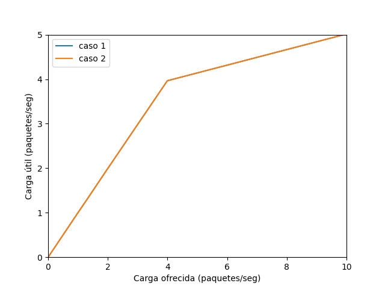
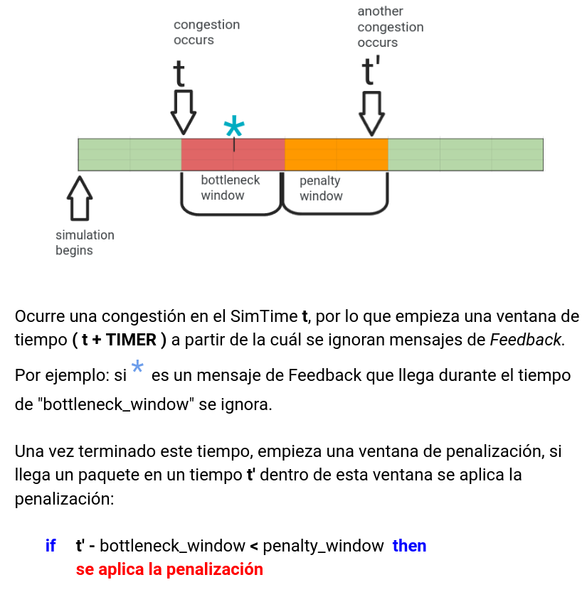
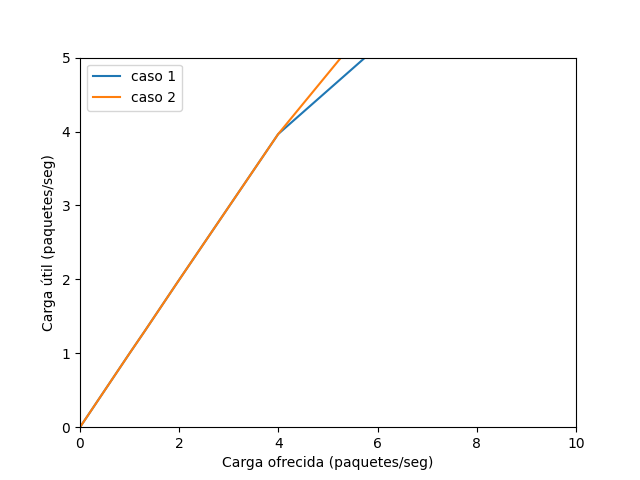
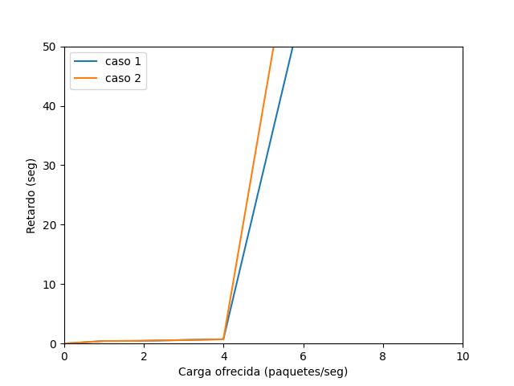
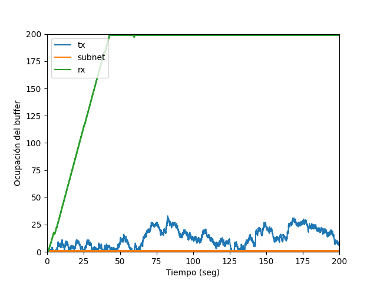
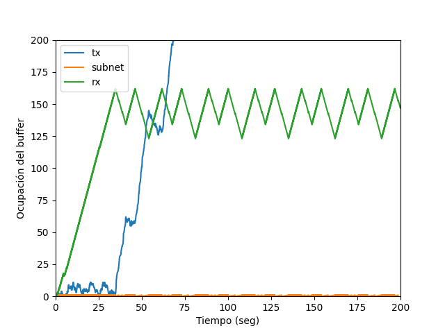

# Análisis de flujo y congestión en redes utilizando simulación discreta y mecanismos de feedback

# Grupo 29

## Integrantes:

- Lara Kurtz, lara.kurtz@mi.unc.edu.ar
- Lautaro Rodri­guez, lautaro.rodriguez@mi.unc.edu.ar

# Abstract

En este informe se analizan problemas de flujo y congestión en la capa de transporte utilizando la herramienta de simulación **Omnet++**, que nos permite modelar y simular redes mediante eventos discretos.

Realizamos simulaciones en dos redes básicas que abstraen el comportamiento de una red real. Una de estas redes presenta problemas de flujo y congestión.

La segunda red es una versión modificada de la primera, en la cual se actualizan los módulos generadores y receptores para permitir el envío y la recepción de mensajes de control. Además, se agrega un canal de comunicación entre el emisor y el receptor, lo que permite al emisor conocer el estado de la red y regular su tasa de envío de paquetes.

Para mitigar los problemas de flujo y congestión, proponemos la siguiente solución: un algoritmo simple que responde a los cuellos de botella, independientemente de la ubicación en la red donde se produzcan.

En cualquier caso, se busca controlar el problema al reducir la velocidad de inyección de paquetes en la red por parte del transmisor.

# Cómo comparamos los distintos escenarios

Con el fin de comparar las diferencias de rendimiento entre los distintos casos de estudio y tipos de redes, llevamos a cabo simulaciones en las que variamos el parámetro `generationInterval` de la red. Este parámetro determina el intervalo de tiempo entre cada generación de paquetes.

Utilizamos las siguientes métricas para evaluar el desempeño:

- Carga ofrecida: se refiere a la cantidad de paquetes que se inyectan en la red por segundo. Esta métrica se calcula contando la cantidad de paquetes que salen del buffer del transmisor durante todo el tiempo de simulación

- Carga útil: representa la cantidad de paquetes que llegan al receptor por segundo. Esta métrica se calcula contando la cantidad de paquetes que llegan al 'sink' durante todo el tiempo de simulación.

- Retardo: indica el tiempo que tardan los paquetes desde que salen del transmisor hasta que llegan al receptor. Esta métrica se calcula como el promedio de los retardos de cada paquete.

Cada una de estas métricas corresponde al resultado final de una única simulación. Para realizar un análisis completo, llevamos a cabo múltiples simulaciones utilizando diferentes valores de generationInterval, tales como `0.1`, `0.25`, `0.5`, `0.75` y `1`. A partir de los datos recopilados, generamos las siguientes curvas que representan los resultados de cada simulación:

- Carga ofrecida vs. carga útil: Comparamos la cantidad de paquetes inyectados por segundo con la cantidad de paquetes que llegan al receptor por segundo.

- Carga ofrecida vs. retardo: Comparamos la cantidad de paquetes inyectados por segundo con el tiempo que tardan en ser entregados.

En estas curvas, cada punto corresponde a los resultados obtenidos de una simulación individual.

# Introducción

En las redes, naturalmente hay nodos con diversas capacidades y conexiones con distinas tasas de transferencia, lo que hace que en la práctica surjan **cuellos de botellas** en nodos; esto quiere decir que reciben paquetes más rápido de lo que pueden procesarlos.

Cuando estos cuellos de botella se encuentran en nodos de la subred entre el transmisor y el receptor se lo denomina problema de congestión, cuando sucede en el nodo receptor se lo denomina **problema de flujo**.

Modelamos una red básica compuesta por tres nodos: un transmisor, un receptor y una queue que abstrae el comportamiento de la subred entre los dos nodos anteriores.

En esta red realizamos simulaciones para dos configuraciones de parámetros distintas, definidas en los casos de estudio 1 y 2.

### Caso de estudio 1

| Conexión           | Datarate       | Delay  |
| ------------------ | -------------- | ------ |
| `NodeTx` a `Queue` | **`1.0 Mbps`** | 100 us |
| `Queue` a `NodeRx` | **`1.0 Mbps`** | 100 us |
| `Queue` a `Sink`   | **`0.5 Mbps`** |        |

Vemos que hay un cuello de botella en NodeRx, ya que los paquetes llegan a NodeRx a una velocidad mucho más rápida (**`1.0 Mbps`**) de lo que salen (**`0.5 Mbps`**). Es decir que el buffer de NodeRx no se vacía lo suficientemente rápido como para dar lugar a los paquetes entrantes.

Esto es un problema de **control de flujo**.

### Caso de estudio 2

| Conexión           | Datarate       | Delay  |
| ------------------ | -------------- | ------ |
| `NodeTx` a `Queue` | **`1.0 Mbps`** | 100 us |
| `Queue` a `NodeRx` | **`0.5 Mbps`** | 100 us |
| `Queue` a `Sink`   | **`1.0 Mbps`** |        |

Vemos que hay un cuello de botella llegando a Queue desde NodeTx, ya que los paquetes llegan a la Queue a una velocidad mucho más rápida (**`1.0 Mbps`**) de la que la Queue es capaz de procesarlos y enviarlos (**`0.5 Mbps`**) (i.e., la Queue no se vacía lo suficientemente rápido como para dar lugar a los paquetes entrantes).

Esto es un problema de **control de congestión**.

### Análisis de casos de estudio

En ambas situaciones se presenta el mismo obstáculo, que es el resultado de un nodo que recibe paquetes a una velocidad de 1Mbps pero solo puede procesarlos a una velocidad de 0.5Mbps. La única diferencia radica en el nodo en el que ocurre este cuello de botella. Por lo tanto, se observa que las curvas para ambos casos son idénticas.

  
  

Podemos observar la pérdida de paquetes ocasionada por los cuellos de botella, la pérdida empieza cuando los buffers se congestionan:

# Algoritmo de control de flujo y congestión

Para implementar el algoritmo propuesto necesitamos modificar la red básica agregadole un canal de comunicación `FeedbackChannel` por el cual el receptor `Receiver` envian `mensajes de feedback` que informan el estado de la red al transmisor `Transmitter`, quedando la red de la siguiente forma:

El algoritmo que implementamos se divide en dos partes:

### Detección del estado de la red

Se establece un umbral del 80% de capacidad tanto en el buffer de la subred como en el del nodo receptor. Cuando alguno de estos nodos alcanza este umbral de utilización del buffer, se envía un paquete de tipo `feedback` al transmisor a través del canal de comunicación.

El transmisor monitorea el estado de la red utilizando un booleano llamado `bottleneck`, que se activa (se establece en `true`) cuando se recibe el primer paquete de `feedback`. A partir de ese momento, se define una ventana de congestión (`CONGESTION_WINDOW`), que indica que hay un cuello de botella en la red, ya sea en la subred o en el nodo receptor. Durante este período, se ignorarán los paquetes de `feedback` que lleguen.

La `CONGESTION_WINDOW` se define como un intervalo de tiempo dentro de la simulación, que comienza en el momento en que se recibe el paquete de `feedback`. Para determinar si hay un cuello de botella en la red, se verifica si el tiempo de simulación ha superado el valor de la `CONGESTION_WINDOW` o no. Una vez transcurrido este tiempo, se desactiva la variable booleana `bottleneck` (se establece en `false`) para indicar que el cuello de botella en la red ha finalizado.

El cálculo de este intervalo se realiza mediante la fórmula: `CONGESTION_WINDOW = simTime() + TIMER`, donde `TIMER` es una constante en segundos de valor arbitario.

### Regulación del transmisor

La regulación del transmisor es efectiva cuando se considera que la red se encuentra en estado `bottleneck` y tiene como objetivo brindar tiempo al nodo receptor para liberar espacio en el búfer y **evitar la pérdida de paquetes**.

Tanto en la red básica como en la modificada, la velocidad de inyección de paquetes en la red está determinada por la frecuencia de los eventos llamados `endServiceEvent`, los cuales se planifican en función del tiempo actual de la simulación y el `serviceTime` (que es el tiempo necesario para atender un paquete en cola).

Para regular la velocidad de transmisión del transmisor, incrementamos el `serviceTime` de todos los paquetes que se envían durante el período `CONGESTION_WINDOW`. Esto lo hacemos multiplicando el `serviceTime` por una variable `mod`.

Adicionalmente, hemos implementado un sistema de penalización que aumenta aún más el `serviceTime` en caso de que ocurran cuellos de botella cercanos en el tiempo. Este sistema de penalización se aplica como un multiplicador adicional sobre `mod`.

Para determinar si es necesario aplicar una penalización a una nueva congestión, establecemos una `PENALIZATION_WINDOW` que funciona de manera similar a la `CONGESTION_WINDOW`, con la diferencia de que esta entra en efecto después de que la última congestión haya finalizado. Al producirse un nuevo cuello de botella, se verifica si el tiempo de simulación ha superado el valor de la `PENALIZATION_WINDOW` y en tal caso, se duplica el modificador aplicado al `serviceTime`.

Dejamos la siguiente línea del tiempo para visualizar el funcionamiento del algoritmo:

# Resultados

Al igual que en el caso de la red básica, realizamos 5 simulaciones variando el parámetro generationInterval. A continuación, se presentan los resultados obtenidos:

Observamos una ligera mejora en comparación con la red básica, especialmente en el caso 2, donde se presenta un cuello de botella en el nodo de la subred. En esta nueva red, se observa una mayor capacidad para soportar cargas de hasta 5 paquetes por segundo antes de experimentar problemas debido al cuello de botella. En contraste, la red básica solo era capaz de soportar hasta 4 paquetes por segundo antes de enfrentar dificultades.

 

  
  

 

No hemos incluido un gráfico de carga ofrecida vs. paquetes descartados, ya que en la nueva red no se pierden paquetes, lo cual era el objetivo de nuestro algoritmo. Sin embargo, hemos observado que el retardo aumenta significativamente, debido a que para evitar el cuello de botella, el transmisor inyecta paquetes en la red a un ritmo **mucho** más lento.

En el siguiente gráfico, podemos apreciar el funcionamiento de nuestro algoritmo en el caso de control, donde el cuello de botella se produciría en el receptor:

 

  
  

 

El primer gráfico corresponde a la red básica, donde se produce congestión. En este caso, el receptor alcanza el límite de capacidad de su búfer y se mantiene constante en ese nivel. Por otro lado, en la nueva red implementada, se realiza una regulación del transmisor para evitar el cuello de botella. Esto se logra limitando la velocidad de envío de paquetes, lo que permite al receptor vaciar su búfer de manera más efectiva.

En el segundo gráfico, que representa la nueva red, podemos observar que los picos de ocupación del búfer del receptor están alrededor del 160, que corresponde al 80% de la capacidad total del búfer.

# Discusión

Nuestro algoritmo logra cumplir su objetivo principal al evitar la pérdida de paquetes en la red. Sin embargo, uno de los efectos secundarios de esta estrategia es el aumento significativo en el retardo de entrega de los paquetes.

Observamos que el retardo se incrementa debido a la limitación del send rate del transmisor, que se realiza para evitar la congestión en el receptor. Esta limitación proporciona tiempo adicional al receptor para procesar y liberar los paquetes de su búfer, lo que garantiza que no se sature. Como resultado, la entrega de paquetes experimenta un mayor retardo en comparación con la red básica.

En resumen, aunque nuestro algoritmo es efectivo en evitar la pérdida de paquetes, reconocemos que existe una compensación en forma de mayor retardo en la entrega de paquetes.

Para mejorar el algoritmo implementado, se nos ocurren algunas ideas. Por ejemplo, podríamos implementar una especie de `slow start` que reduzca drásticamente la frecuencia de inyección de paquetes en la red al detectar un cuello de botella, y que incremente gradualmente esta frecuencia hasta alcanzar su valor original. Este incremento podría ser detenido por la aparición de un nuevo cuello de botella, lo que reiniciaría el proceso de `slow start`. Además, en lugar de determinar de manera arbitraria el tiempo de la `CONGESTION_WINDOW` y la tasa de reducción del _send rate_ del emisor, podríamos calcular estos valores en función de la utilización del búfer en el que se haya producido el cuello de botella.

# Referencias

- [Omnet++](https://omnetpp.org/)
- [Gráficos de carga ofrecida vs carga útil](https://youtu.be/W8r8zSPjeAs)
