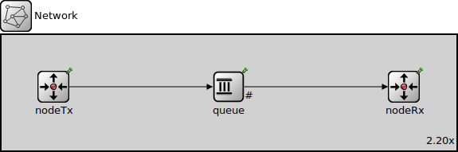

# Grupo 29

## Integrantes:

- Lara Kurtz, lara.kurtz@mi.unc.edu.ar
- Lautaro Rodri­guez, lautaro.rodriguez@mi.unc.edu.ar

# Abstract

En este informe se analizan problemas de flujo y congestión en la capa de transporte utilizando la herramienta de simulación **Omnet++**, que nos permite modelar y simular redes mediante eventos discretos.

Realizamos simulaciones en dos redes básicas que abstraen el comportamiento de una red real. Una de estas redes presenta problemas de flujo y congestión.

La segunda red es una versión modificada de la primera, en la cual se actualizan los módulos generadores y receptores para permitir el envío y la recepción de mensajes de control. Además, se agrega un canal de comunicación entre el emisor y el receptor, lo que permite al emisor conocer el estado de la red y regular su tasa de envío de paquetes.

Para mitigar los problemas de flujo y congestión, proponemos la siguiente solución: un algoritmo simple que responde a los cuellos de botella, independientemente de la ubicación en la red donde se produzcan.

En cualquier caso, se busca controlar el problema al reducir la velocidad de inyección de paquetes en la red por parte del transmisor.

# Introducción

