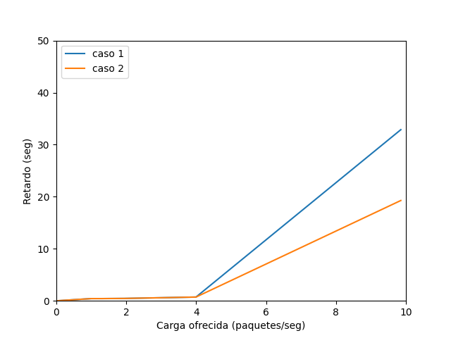

# Grupo 29

## Integrantes:

- Lara Kurtz, lara.kurtz@mi.unc.edu.ar
- Lautaro Rodri­guez, lautaro.rodriguez@mi.unc.edu.ar

# Abstract

En este informe se analizan problemas de flujo y congestión en la capa de transporte utilizando la herramienta de simulación **Omnet++**, que nos permite modelar y simular redes mediante eventos discretos.

Realizamos simulaciones en dos redes básicas que abstraen el comportamiento de una red real. Una de estas redes presenta problemas de flujo y congestión.

La segunda red es una versión modificada de la primera, en la cual se actualizan los módulos generadores y receptores para permitir el envío y la recepción de mensajes de control. Además, se agrega un canal de comunicación entre el emisor y el receptor, lo que permite al emisor conocer el estado de la red y regular su tasa de envío de paquetes.

Para mitigar los problemas de flujo y congestión, proponemos la siguiente solución: un algoritmo simple que responde a los cuellos de botella, independientemente de la ubicación en la red donde se produzcan.

En cualquier caso, se busca controlar el problema al reducir la velocidad de inyección de paquetes en la red por parte del transmisor.

# Introducción

En las redes, naturalmente hay nodos con diversas capacidades y conexiones con distinas tasas de transferencia, lo que hace que en la práctica surjan **cuellos de botellas** en nodos; esto quiere decir que reciben paquetes más rápido de lo que pueden procesarlos.

Cuando estos cuellos de botella se encuentran en nodos de la subred entre el transmisor y el receptor se lo denomina problema de congestión, cuando sucede en el nodo receptor se lo denomina **problema de flujo**.

Modelamos una red básica compuesta por tres nodos: un transmisor, un receptor y una queue que abstrae el comportamiento de la subred entre los dos nodos anteriores.

En esta red realizamos simulaciones para dos configuraciones de parámetros distintas, definidas en los casos de estudio 1 y 2.

### Caso de estudio 1

| Conexión           | Datarate       | Delay  |
| ------------------ | -------------- | ------ |
| `NodeTx` a `Queue` | **`1.0 Mbps`** | 100 us |
| `Queue` a `NodeRx` | **`1.0 Mbps`** | 100 us |
| `Queue` a `Sink`   | **`0.5 Mbps`** |        |

Vemos que hay un cuello de botella en NodeRx, ya que los paquetes llegan a NodeRx a una velocidad mucho más rápida (**`1.0 Mbps`**) de lo que salen (**`0.5 Mbps`**). Es decir que el buffer de NodeRx no se vacía lo suficientemente rápido como para dar lugar a los paquetes entrantes.

Esto es un problema de **control de flujo**.

### Caso de estudio 2

| Conexión           | Datarate       | Delay  |
| ------------------ | -------------- | ------ |
| `NodeTx` a `Queue` | **`1.0 Mbps`** | 100 us |
| `Queue` a `NodeRx` | **`0.5 Mbps`** | 100 us |
| `Queue` a `Sink`   | **`1.0 Mbps`** |        |

Vemos que hay un cuello de botella llegando a Queue desde NodeTx, ya que los paquetes llegan a la Queue a una velocidad mucho más rápida (**`1.0 Mbps`**) de la que la Queue es capaz de procesarlos y enviarlos (**`0.5 Mbps`**) (i.e., la Queue no se vacía lo suficientemente rápido como para dar lugar a los paquetes entrantes).

Esto es un problema de **control de congestión**.

### Análisis de casos de estudio

En ambas situaciones se presenta el mismo obstáculo, que es el resultado de un nodo que recibe paquetes a una velocidad de 1Mbps pero solo puede procesarlos a una velocidad de 0.5Mbps. La única diferencia radica en el nodo en el que ocurre este cuello de botella. Por lo tanto, se observa que las curvas para ambos casos son idénticas.

  
  

ofrecida_vs_util_parte2.png

ofrecida_vs_retardo_parte2.png

# Algoritmo de control de flujo y congestión

Para implementar el algoritmo propuesto necesitamos modificar la red básica agregadole un canal de comunicación `FeebackChannel` por el cual el receptor `Receiver` envian `mensajes de feedback` que informan el estado de la red al transmisor `Transmitter`, quedando la red de la siguiente forma:

El algoritmo que implementamos se divide en dos partes:

### Detección del estado de la red

Tanto en el buffer de la subred como en el del nodo receptor se establece un umbral en base a la capacidad del mismo. Cuando se alcanza el umbral del buffer en alguno de los nodos, este envía un paquete de tipo `feedback` por el canal de comunicación.

El transmisor lleva cuenta del estado de la red mediante un booleano `bottleneck` que se setea a `true` la primera vez que se recibe un mensaje de feedback.

Se define un tiempo arbitrario `TIMER` durante el cual se considera que la red sigue en estado `bottleneck`. Lo utilizamos para definir un tiempo en la simulación a partir del cual dejamos de estar en estado `bottleneck`, dicho tiempo queda determinado por la variable `CONGESTION_WINDOW = simTime() + TIMER`.

### Regulación del transmisor

La regulación del transmisor es efectiva cuando se considera que la red se encuentra en estado `bottleneck` y tiene como objetivo brindar tiempo al nodo receptor para liberar espacio en el búfer y _evitar la pérdida de paquetes_.

Tanto en la red básica como en la modificada, la velocidad de inyección de paquetes en la red está determinada por la frecuencia de los eventos llamados `endServiceEvent`, los cuales se planifican en función del tiempo actual de la simulación y el `serviceTime` (que es el tiempo necesario para atender un paquete en cola).

Para regular la velocidad de transmisión del transmisor, incrementamos el `serviceTime` de todos los paquetes que se envían durante ese período.

Además, hemos implementado un sistema de penalización que aumenta aún más el `serviceTime` en caso de que ocurran cuellos de botella cercanos en el tiempo.

# Resultados

# Discusión

# Referencias

- [Omnet++](https://omnetpp.org/)
- [Gráficos de carga ofrecida vs carga útil](https://youtu.be/W8r8zSPjeAs)
